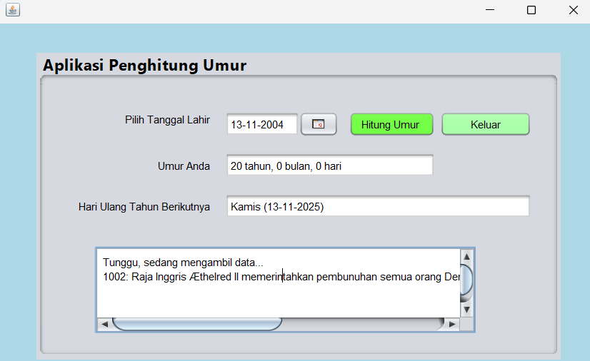

# AplikasiPerhitunganUmur
 Latihan2_NovitaFitriaRatnawati_2210010228
 
# Aplikasi Perhitungan Umur
Aplikasi Perhitungan Umur adalah aplikasi untuk menghitung jumlah selisih umur

# Keunggulan Aplikasi
- Perhitungan Umur: Aplikasi ini terdapat Jdatechooser untuk memilih tanggal

# Pembuat Aplikasi
 Novita Fitria Ratnawati - 2210010228 - Latihan 2

# Fitur
Aplikasi ini menawarkan fitur:

Perhitungan Umur

## Cara Menjalankan

1. Run File
2. Pilih Tanggal Awal yang mau kita input menggunakan Jdatechooser
3. Tekan Button Hitung Umur, Maka akan keluar hasil
5. Tekan Button Keluar, jika ingin keluar

# Demo
